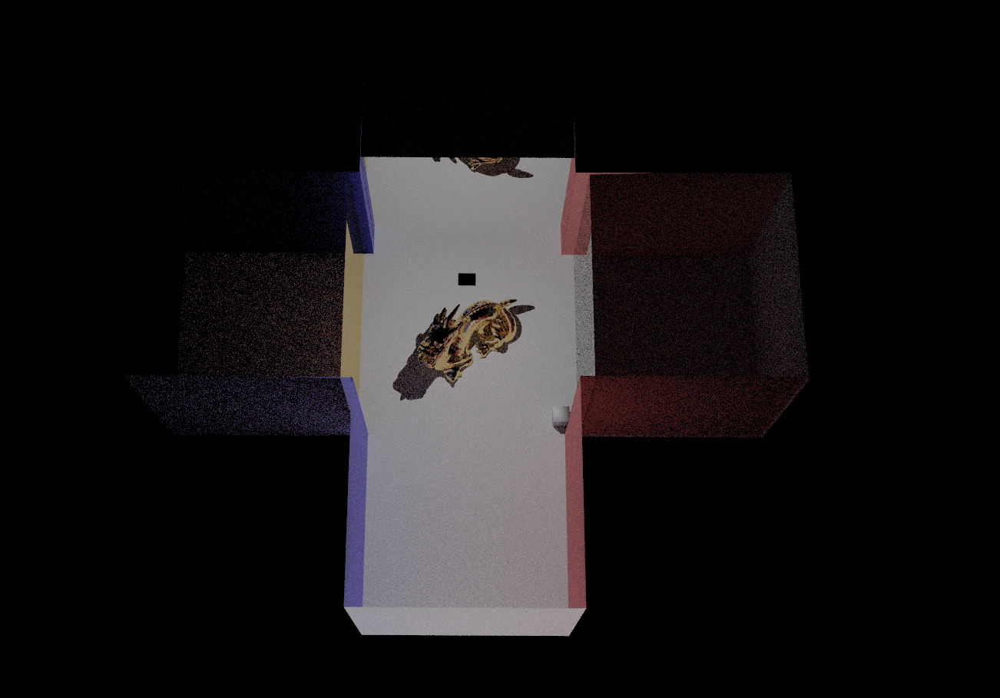

## What we have accomplished:
* We added an element of energy drop-off to the project3-2 raytracer to model radio waves instead of light rays. The drop-off both as a function of time and of the materials the ray has passed through
* Created a test scene with some new material modeling.
    *  The three materials we chose to model are
         * glass(a material that lets rays through some of the time) ,
         * mirror (which in the case of wifi, is most similar to aluminum, reflecting rays most of the time),
         * and concrete(a material that largely absorbs wifi rays)).
     * These are linearly independent in a sense and represent the span of materials with respect to wifi absorption/reflectance.
* As you can see in this picture, the top wall is modeling reflectance, the right wall is modeling absorption, and the left is modeling rays passing through.

